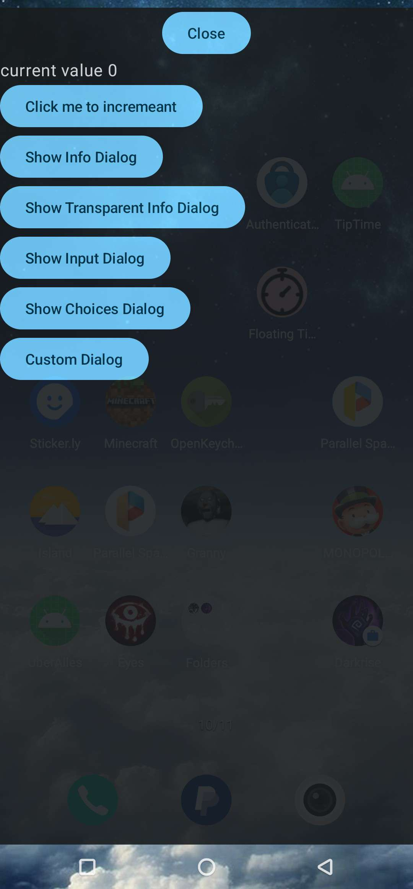
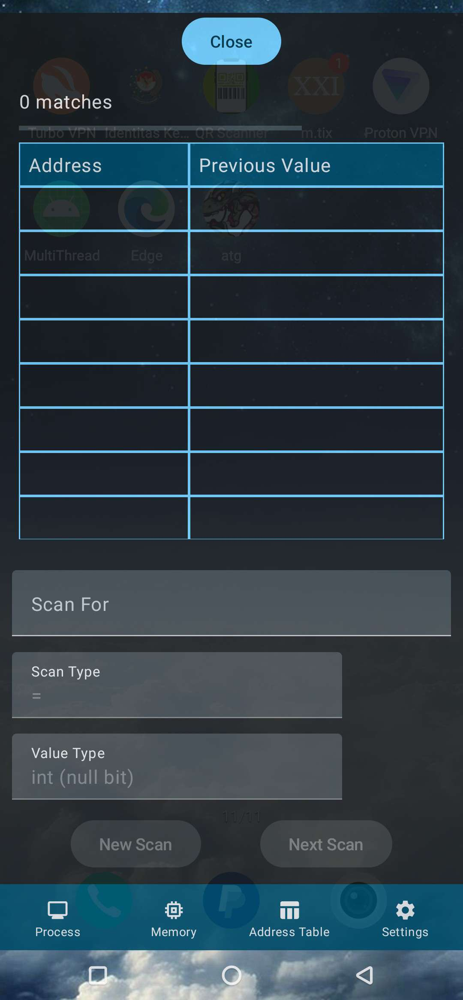

# UberAlles
[](https://jitpack.io/#KuhakuPixel/UberAlles)

`UberAlles` the german word for `above all`

is an experimental library for creating on top of everything view
in android with jetpack compose







## Download 

- add `maven { url "https://jitpack.io" }` in `settings.gradle`

```groovy
dependencyResolutionManagement {
    repositoriesMode.set(RepositoriesMode.FAIL_ON_PROJECT_REPOS)
    repositories {
        google()
        mavenCentral()
        maven { url "https://jitpack.io" }
    }
}

```
add to your app's `build.gradle`
```groovy
dependencies {
    def libUberAllesVersion = '0.0.2'
    implementation "com.github.KuhakuPixel:UberAlles:${libUberAllesVersion}"
}
```
## Usage
full example of usage [here](./app/)


### Add Permission

add code below to `AndroidManifest.xml`
```xml
    <uses-permission android:name="android.permission.ACTION_MANAGE_OVERLAY_PERMISSION" />
    <uses-permission android:name="android.permission.SYSTEM_ALERT_WINDOW" />
    <uses-permission android:name="android.permission.FOREGROUND_SERVICE" />

```
### Asking Overlay Permission
drawing overlay requires user's permission, so call this in your `MainActivity` class
(that subclass `ComponentActivity`)

```kotlin
if (!Settings.canDrawOverlays(context)) {
    OverlayPermission.askForOverlayPermission(
        context = applicationContext,
        componentActivity = this
    )
}

```
### Making Overlay Service

visit [here](./app/src/main/java/com/kuhakupixel/uberalles/MyOverlayServiceEntry.kt) for full code
```kotlin
import com.kuhakupixel.uberalles.ui.theme.UberAllesTheme

class MyOverlayServiceEntry : OverlayServiceEntry() {

    override fun onCreate() {
        super.onCreate()
        // Initialize Overlay Context for drawing dialog and etc
        val overlayContext = OverlayContext(
            windowManager = this.windowManager, service = this,
            applyTheme = { content ->
                // applying theme to overlay view
                UberAllesTheme(darkTheme = true) {
                    // A surface container using the 'background' color from the theme
                    Surface(
                        modifier = Modifier.fillMaxSize(),
                        color = MaterialTheme.colorScheme.background,
                        content = content
                    )
                }
            },
        )
        // initialize your view here
    }

    override fun onOverlayServiceStarted() {
        // enable your view here
    }
}
```

starting overlay service
```kotlin 
fun startOverlayButton(context: Context) {
    val intent = Intent(context.applicationContext, MyOverlayServiceEntry::class.java)
    context.startForegroundService(intent)
}
```

### Add the class to your manifest
add them inside `application` tag
```xml
<service
    android:name=".MyOverlayServiceEntry"
    android:label="My Service"></service>
```


## Credit
original code is from https://github.com/tberghuis/FloatingCountdownTimer
which is then heavily refactored to be used as a library
## Limitation
### - `DropDownMenu` not shown
### - [Alert Dialog](https://developer.android.com/reference/kotlin/androidx/compose/material3/package-summary#AlertDialog(kotlin.Function0,kotlin.Function0,androidx.compose.ui.Modifier,kotlin.Function0,kotlin.Function0,kotlin.Function0,kotlin.Function0,androidx.compose.ui.graphics.Shape,androidx.compose.ui.graphics.Color,androidx.compose.ui.graphics.Color,androidx.compose.ui.graphics.Color,androidx.compose.ui.graphics.Color,androidx.compose.ui.unit.Dp,androidx.compose.ui.window.DialogProperties)) 

will crash, current workaround is to use functions from this library to show Dialog
### - `context`'s type is `Service` 

can't be cast into `Activity`,  

problem is when you want to apply 
a theme to a composable function
in overlay view, using `ui.theme.Theme`

where by default in your compose project you should have something like

```kotlin
@Composable
fun ProjectNameTheme(
    darkTheme: Boolean = isSystemInDarkTheme(),
    // Dynamic color is available on Android 12+
    dynamicColor: Boolean = true,
    content: @Composable () -> Unit
) {
    val colorScheme = when {
        dynamicColor && Build.VERSION.SDK_INT >= Build.VERSION_CODES.S -> {
            val context = LocalContext.current
            if (darkTheme) dynamicDarkColorScheme(context) else dynamicLightColorScheme(context)
        }

        darkTheme -> DarkColorScheme
        else -> LightColorScheme
    }
    val view = LocalView.current
    if (!view.isInEditMode) {
        SideEffect {
            val window = (view.context as Activity).window
            window.statusBarColor = colorScheme.primary.toArgb()
            WindowCompat.getInsetsController(window, view).isAppearanceLightStatusBars = darkTheme
        }
    }

    MaterialTheme(
        colorScheme = colorScheme,
        typography = Typography,
        content = content
    )
}
```

current workaround is to just comment/remove the code where it is casting `context`
into `Activity`
```kotlin
    if (!view.isInEditMode) {
        SideEffect {
            val window = (view.context as Activity).window
            window.statusBarColor = colorScheme.primary.toArgb()
            WindowCompat.getInsetsController(window, view).isAppearanceLightStatusBars = darkTheme
        }
    }
```
then after that you can apply theme to your overlay view
## Useful Reference

### Using Jetpackcompose as overlay
https://www.jetpackcompose.app/snippets/OverlayService
https://gist.github.com/handstandsam/6ecff2f39da72c0b38c07aa80bbb5a2f#file-overlayservice-kt
https://github.com/tberghuis/FloatingCountdownTimer

### Requesting Overlay Permission
https://stackoverflow.com/questions/40437721/how-to-give-screen-overlay-permission-on-my-activity
https://stackoverflow.com/questions/52382710/permission-denial-startforeground-requires-android-permission-foreground-servic


## License
This project is licensed under `Mozilla Public License
Version 2.0`. Please refer to [LICENSE](./LICENSE.md) for the full text.